<p align="center">
  
  
  
  
  
  
</p>

<h1 align="center">🛡️ SOLYD Server</h1>

<p align="center">
  <strong>The backend that connects your Shopify store to the Solana blockchain</strong><br/>
  <em>Save wallets • Mint collectible NFTs • Handle thousands of orders • Show live updates</em>
</p>

<p align="center">
  🔗 <strong>Frontend (Inner Circle VIP Portal):</strong> <a href="https://github.com/solydstore/inner_circle_solyd_hackathon">solydstore/inner_circle_solyd_hackathon</a>
</p>

<p align="center">
  <a href="#-quick-start">Quick Start</a> •
  <a href="#-what-does-this-thing-do">What Does It Do?</a> •
  <a href="#-architecture">Architecture</a> •
  <a href="#-api-reference">API Reference</a> •
  <a href="#-shopify-authentication">Shopify Auth</a> •
  <a href="#-nft-minting">NFT Minting</a> •
  <a href="#-deployment">Deployment</a>
</p>

---

## 📋 Table of Contents

<details>
<summary>Click to expand</summary>

- [Quick Start](#-quick-start)
- [What Does This Thing Do?](#-what-does-this-thing-do)
- [Architecture](#-architecture)
- [API Reference](#-api-reference)
  - [Health](#health)
  - [Wallet Management](#wallet-management)
  - [SBT Claiming](#sbt-claiming)
  - [Legacy Orders](#legacy-orders)
  - [Real-Time Events](#real-time-events-sse)
- [Shopify Authentication](#-shopify-authentication)
- [NFT Minting System](#-nft-minting-system)
  - [Brand Metadata Selection](#-brand-metadata-selection)
  - [Off-Chain Metadata & Website Link](#-off-chain-metadata--website-link)
  - [Burn Authority](#-burn-authority-who-can-destroy-a-soulbound-cnft)
- [MailerLite VIP Sync](#-mailerlite-vip-sync)
- [Real-Time Events (SSE)](#-real-time-events-sse)
- [Redis Queue System](#-redis-queue-system)
- [Technology Stack](#-technology-stack)
- [Project Structure](#-project-structure)
- [Security](#-security)
- [Environment Variables](#-environment-variables)
- [Deployment](#-deployment)
- [Local Development](#-local-development)
- [Troubleshooting](#-troubleshooting)
- [Related Repositories](#-related-repositories)
- [Documentation Links](#-documentation-links)

</details>

---

## 🆕 What's new (most recent first)

> Onboarding tip: if you're a new hire, read this section first — it's the diff between this README and the one from a few weeks ago.

| Date                         | Change                                                                                                                                                                               | Where to look                                                                                        |
| :--------------------------- | :----------------------------------------------------------------------------------------------------------------------------------------------------------------------------------- | :--------------------------------------------------------------------------------------------------- |
| 🏷️ Brand-prefix metadata     | The minter now picks the NFT's name + URI from the **product's leading brand** (`BORN SOLYD`, `MONKE CONSOLE`, `KING BONK`, ...). Configurable per brand via `URI_<BRAND>` env vars. | [Brand Metadata Selection](#-brand-metadata-selection) · `src/services/minting.ts`                   |
| 🌐 Website link on NFTs      | Off-chain JSON templates in `metadata/` add `external_url: "https://solyd.store"` so wallets show the website.                                                                       | [Off-Chain Metadata & Website Link](#-off-chain-metadata--website-link) · `metadata/born-solyd.json` |
| 📬 MailerLite VIP sync       | Wallet save → VIP MEMBERS group. Each mint recomputes rank (silver / purple / platina) based on total mints, single-rank invariant enforced. Fully optional.                         | [MailerLite VIP Sync](#-mailerlite-vip-sync) · `src/services/mailerlite.ts`                          |
| 🏷️ Customer tagging          | First wallet save tags the Shopify customer with `vip-activated`; that tag also re-fires the VIP MEMBERS subscription.                                                               | `src/services/wallet.ts`, `src/services/mailerlite.ts`                                               |
| 🔥 Burn authority documented | Soulbound cNFTs can only be burned by the **collection update authority** (= our minting wallet). Owners can't, by design.                                                           | [Burn Authority](#-burn-authority-who-can-destroy-a-soulbound-cnft)                                  |

---

## 🚀 Quick Start

```bash
# Clone & Install
git clone https://github.com/your-org/solyd-server.git
cd solyd-server && npm install

# Configure
cp .env.example .env   # Edit with your real values

# Run
npm run dev

# Test
curl http://localhost:3000/api/health
```

---

## 📖 What Does This Thing Do?

> **ELI5:** Imagine a store that gives you a special collectible sticker every time you buy something. This server is the worker in the back who prints the sticker, saves your address, and sends it to you.

### The big picture

| Feature                    | What it does (simple)                                                         |
| :------------------------- | :---------------------------------------------------------------------------- |
| 🔗 **Wallet Connection**   | Remembers which Solana wallet belongs to which customer                       |
| 🎨 **SBT Minting**         | Creates a one-of-a-kind collectible for every product purchased               |
| 🏷️ **Brand Metadata**      | Auto-picks the right artwork+name based on the product's brand prefix         |
| 📜 **Legacy Support**      | Still shows old collectibles from orders made before the new system           |
| ⚡ **Job Queue**           | Lets thousands of people claim collectibles at the same time without breaking |
| 📡 **Real-Time Updates**   | Tells the customer "your NFT is ready!" the exact moment it finishes          |
| 📊 **Order Tracking**      | Writes the claim status back to Shopify so nothing gets lost                  |
| 📬 **MailerLite VIP Sync** | Tags the customer in MailerLite + auto-promotes them silver→purple→platina    |

### Why we need a server at all

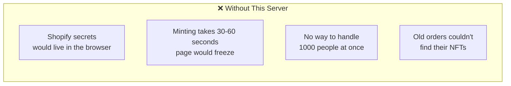
```mermaid
flowchart LR
    subgraph Problems["❌ Without This Server"]
        A[Shopify secrets<br/>would live in the browser]
        B[Minting takes 30-60 seconds<br/>page would freeze]
        C[No way to handle<br/>1000 people at once]
        D[Old orders couldn't<br/>find their NFTs]
    end
```

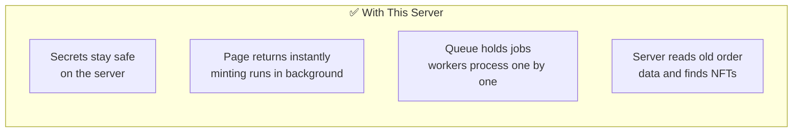
```mermaid
flowchart LR
    subgraph Solutions["✅ With This Server"]
        E[Secrets stay safe<br/>on the server]
        F[Page returns instantly<br/>minting runs in background]
        G[Queue holds jobs<br/>workers process one by one]
        H[Server reads old order<br/>data and finds NFTs]
    end
```

---

## 🏗 Architecture

### The whole system at a glance

> **ELI5:** The customer's browser talks to Vercel (front desk). Vercel calls us (the kitchen). We drop the order into a queue (like a line at lunch). A worker picks it up, does the work, and tells the front desk when it's done.

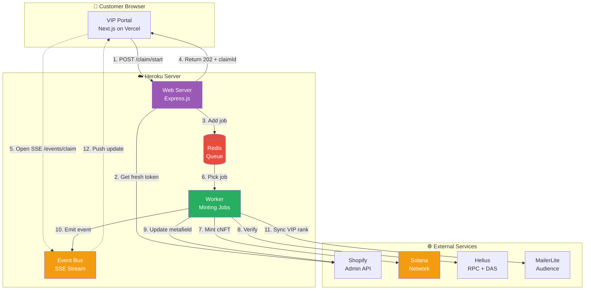
```mermaid
flowchart TB
    subgraph Customer["👤 Customer Browser"]
        A[VIP Portal<br/>Next.js on Vercel]
    end

    subgraph Heroku["☁️ Heroku Server"]
        B[Web Server<br/>Express.js]
        C[(Redis<br/>Queue)]
        D[Worker<br/>Minting Jobs]
        EV[Event Bus<br/>SSE Stream]
    end

    subgraph External["🌐 External Services"]
        E[Shopify<br/>Admin API]
        F[Solana<br/>Network]
        G[Helius<br/>RPC + DAS]
        ML[MailerLite<br/>Audience]
    end

    A -->|1. POST /claim/start| B
    B -->|2. Get fresh token| E
    B -->|3. Add job| C
    B -->|4. Return 202 + claimId| A
    A -.->|5. Open SSE /events/claim| EV
    C -->|6. Pick job| D
    D -->|7. Mint cNFT| F
    D -->|8. Verify| G
    D -->|9. Update metafield| E
    D -->|10. Emit event| EV
    D -->|11. Sync VIP rank| ML
    EV -.->|12. Push update| A

    style B fill:#9b59b6,color:#fff
    style C fill:#e74c3c,color:#fff
    style D fill:#27ae60,color:#fff
    style EV fill:#f39c12,color:#fff
    style F fill:#f39c12,color:#fff
```

### What happens when someone clicks "Claim"

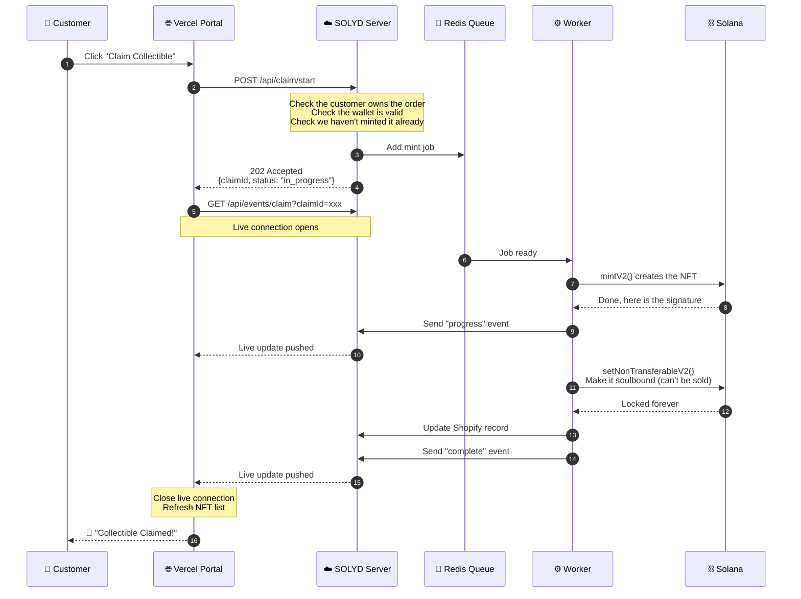
```mermaid
sequenceDiagram
    autonumber
    participant C as 👤 Customer
    participant V as 🌐 Vercel Portal
    participant H as ☁️ SOLYD Server
    participant R as 🔴 Redis Queue
    participant W as ⚙️ Worker
    participant SOL as ⛓️ Solana

    C->>V: Click "Claim Collectible"
    V->>H: POST /api/claim/start

    Note over H: Check the customer owns the order<br/>Check the wallet is valid<br/>Check we haven't minted it already

    H->>R: Add mint job
    H-->>V: 202 Accepted<br/>{claimId, status: "in_progress"}

    V->>H: GET /api/events/claim?claimId=xxx
    Note over V,H: Live connection opens

    R->>W: Job ready
    W->>SOL: mintV2() creates the NFT
    SOL-->>W: Done, here is the signature

    W->>H: Send "progress" event
    H-->>V: Live update pushed

    W->>SOL: setNonTransferableV2()<br/>Make it soulbound (can't be sold)
    SOL-->>W: Locked forever

    W->>H: Update Shopify record
    W->>H: Send "complete" event
    H-->>V: Live update pushed

    Note over V: Close live connection<br/>Refresh NFT list

    V-->>C: 🎉 "Collectible Claimed!"
```

---

## 📡 API Reference

### How to talk to the server

Every protected endpoint needs a secret password in the header:

```bash
curl -X POST https://your-server.herokuapp.com/api/claim/start \
  -H "Content-Type: application/json" \
  -H "x-api-secret: your-32-character-secret" \
  -d '{ ... }'
```

> **ELI5:** Think of `x-api-secret` as a bouncer checking your name on the list before letting you in the club.

---

### Health

#### `GET /api/health`

The "is the server awake?" check. No password needed.

```json
{ "status": "ok" }
```

#### `GET /api/claim/health`

Tells you how full the NFT tree is (password needed).

<details>
<summary>📤 Response Example</summary>

```json
{
  "success": true,
  "tree": {
    "minted": 500,
    "capacity": 16384,
    "remaining": 15884,
    "percentUsed": "3.05",
    "isFull": false
  }
}
```

</details>

---

### Wallet Management

#### `POST /api/wallet/save`

Remembers which wallet belongs to the customer.

<details>
<summary>📥 Request</summary>

```json
{
  "customerId": "gid://shopify/Customer/123456789",
  "walletAddress": "DYw8jCTfwHNRJhhmFcbXvVDTqWMEVFBX6ZKUmG5CNSKK",
  "walletSource": "external"
}
```

</details>

<details>
<summary>📤 Response</summary>

```json
{
  "success": true,
  "walletAddress": "DYw8jCTfwHNRJhhmFcbXvVDTqWMEVFBX6ZKUmG5CNSKK",
  "customerId": "gid://shopify/Customer/123456789"
}
```

</details>

#### `GET /api/wallet/:customerId`

Looks up the wallet we saved earlier.

---

### SBT Claiming

#### `POST /api/claim/start`

Start minting NFTs for the things someone bought.

<details>
<summary>📥 Request</summary>

```json
{
  "customerId": "gid://shopify/Customer/123456789",
  "orderId": "gid://shopify/Order/987654321",
  "lineItemIds": ["gid://shopify/LineItem/111222333"],
  "walletAddress": "DYw8jCTfwHNRJhhmFcbXvVDTqWMEVFBX6ZKUmG5CNSKK"
}
```

</details>

<details>
<summary>📤 Response (202 Accepted)</summary>

```json
{
  "success": true,
  "message": "Claim initiated. Your collectibles are being minted.",
  "claimId": "9ed0773f-9953-4b30-af83-3e4f42acdd76",
  "lineItems": [
    {
      "lineItemId": "gid://shopify/LineItem/111222333",
      "status": "in_progress"
    }
  ]
}
```

</details>

#### `POST /api/claim/status`

Check where the minting is at for an order.

#### `POST /api/claim/retry`

Try again if minting failed.

---

### Legacy Orders

> **ELI5:** We changed how we store NFT info in Shopify. This endpoint reads the OLD way so customers who bought stuff ages ago don't lose their collectibles.

#### `POST /api/legacy/orders`

Looks up old orders that have NFT addresses stored in Shopify's `note_attributes` (the old system) instead of metafields (the new system).

<details>
<summary>📥 Request</summary>

```json
{
  "orderNames": ["#4583", "#4582", "#4581"]
}
```

</details>

<details>
<summary>📤 Response</summary>

```json
{
  "success": true,
  "orders": [
    {
      "orderId": "gid://shopify/Order/7001042846038",
      "orderName": "#4583",
      "orderDate": "2025-11-07T14:55:41+01:00",
      "customerWallet": "GbwmY7J85iYCQ5hHTEWnbhGhQgQsBH2a2rnaGBP3GDFm",
      "assetIds": [
        "3vEPv5wTaZaVtC9Wubkwcrn69GRd82c4d86Hnju9p3Ft",
        "GMJHssvCUuL2MHRgj8VLeny6zKH7TAp76Scr48uZkNy8"
      ],
      "lineItems": [
        { "id": "gid://...", "name": "Raposa Phone Case - Solana Seeker" }
      ]
    }
  ],
  "total": 1
}
```

</details>

**How it matches old NFTs to products:** The frontend takes the `assetIds` array and matches each one to a line item by product name (strips the " - Solana Seeker" suffix and compares).

---

### Real-Time Events (SSE)

#### `GET /api/events/claim?claimId=xxx`

Opens a live connection that pushes updates the moment the worker finishes each NFT.

<details>
<summary>📡 What the stream looks like</summary>

```bash
curl -N -H "x-api-secret: your-secret" \
  "https://your-server.herokuapp.com/api/events/claim?claimId=fb4fe603-..."
```

```
event: connected
data: {"claimId":"fb4fe603-..."}

event: mint_update
data: {"type":"mint_progress","lineItemId":"gid://shopify/LineItem/111","data":{"mint_status":"in_progress"}}

event: mint_update
data: {"type":"mint_complete","lineItemId":"gid://shopify/LineItem/111","data":{"mint_status":"minted","asset_id":"ABC..."}}
```

</details>

| Behavior          | Detail                                      |
| :---------------- | :------------------------------------------ |
| Heartbeat         | `:heartbeat` comment every 30s              |
| Timeout           | Auto-closes after 5 minutes                 |
| Client disconnect | Server cleans up listeners immediately      |
| Multiple items    | Events fire per line item as each completes |

---

## 🔐 Shopify Authentication

> **ELI5:** Shopify used to give apps a forever-password. Now they only give a short-lived one that expires every day. This is good (safer if leaked) but means we need a tiny program that asks for a new password automatically.

### What changed (and why)

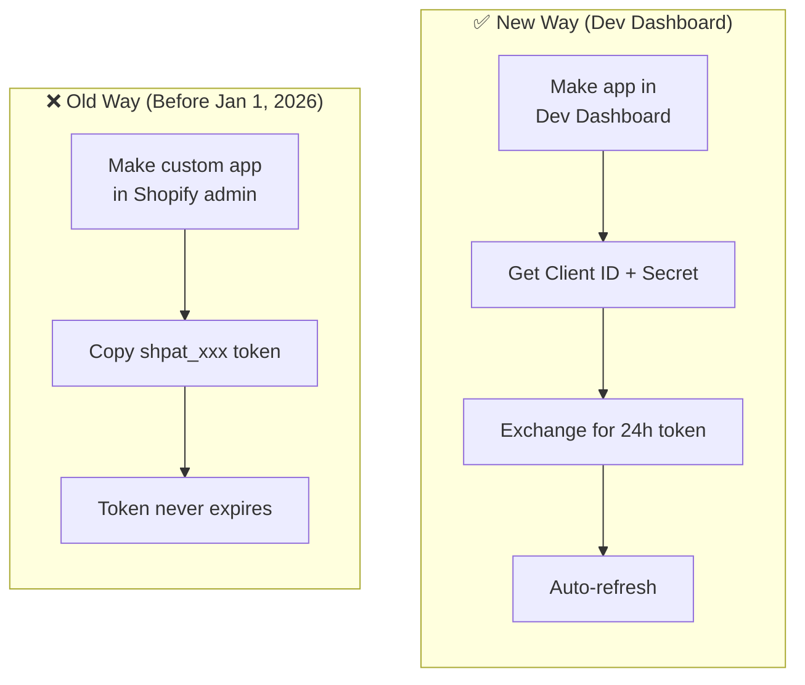
```mermaid
flowchart LR
    subgraph Old["❌ Old Way (Before Jan 1, 2026)"]
        A1[Make custom app<br/>in Shopify admin]
        A2[Copy shpat_xxx token]
        A3[Token never expires]
        A1 --> A2 --> A3
    end

    subgraph New["✅ New Way (Dev Dashboard)"]
        B1[Make app in<br/>Dev Dashboard]
        B2[Get Client ID + Secret]
        B3[Exchange for 24h token]
        B4[Auto-refresh]
        B1 --> B2 --> B3 --> B4
    end

    Old ~~~ New
```

Shopify killed the old "legacy custom apps" on January 1, 2026. Every new app created after that date uses OAuth client credentials instead of a static token.

### How our token manager works

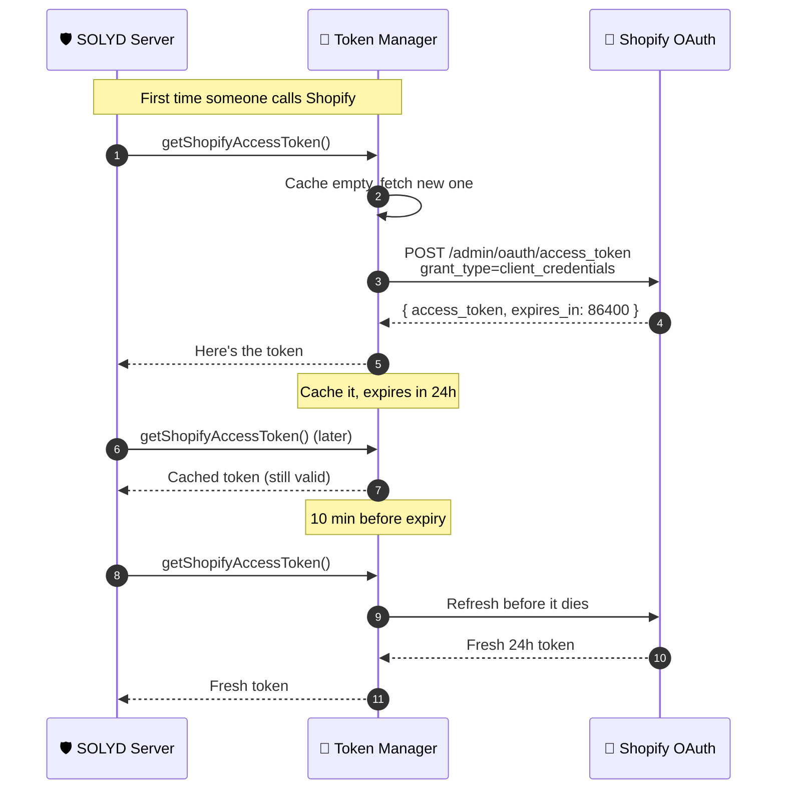
```mermaid
sequenceDiagram
    autonumber
    participant App as 🛡️ SOLYD Server
    participant Token as 🔑 Token Manager
    participant Shop as 🛒 Shopify OAuth

    Note over App,Token: First time someone calls Shopify

    App->>Token: getShopifyAccessToken()
    Token->>Token: Cache empty, fetch new one
    Token->>Shop: POST /admin/oauth/access_token<br/>grant_type=client_credentials
    Shop-->>Token: { access_token, expires_in: 86400 }
    Token-->>App: Here's the token

    Note over Token: Cache it, expires in 24h

    App->>Token: getShopifyAccessToken() (later)
    Token-->>App: Cached token (still valid)

    Note over Token: 10 min before expiry

    App->>Token: getShopifyAccessToken()
    Token->>Shop: Refresh before it dies
    Shop-->>Token: Fresh 24h token
    Token-->>App: Fresh token
```

| Piece                   | What it does                                                  |
| :---------------------- | :------------------------------------------------------------ |
| `shopifyToken.ts`       | Asks Shopify for tokens, caches them, refreshes before expiry |
| 10-minute safety buffer | Refreshes 10 min early so we never use an expired token       |
| Deduplication           | If 5 requests come in at once, only 1 actually calls Shopify  |
| `shopify.ts`            | Uses `getShopifyAccessToken()` before every GraphQL call      |

### Required Shopify setup

1. Go to [Dev Dashboard](https://dev.shopify.com/dashboard) > your app
2. **Configuration** > add scopes: `read_orders`, `read_all_orders`, `read_customers`, `write_customers`
3. **API access requests** > request **Protected Customer Data** access
4. **Release** a new version
5. **Install** the app on your store
6. Copy Client ID and Client Secret into Heroku env vars

> ⚠️ `read_all_orders` is REQUIRED if you want to access orders older than 60 days. The Legacy Orders endpoint needs this.

---

## 🎨 NFT Minting System

### What is a "Soulbound NFT"?

> **ELI5:** A regular NFT is like a trading card you can give or sell to anyone. A soulbound NFT is like a tattoo: it is stuck to you forever. We use these so proof-of-purchase collectibles can't be faked by buying them from someone else.

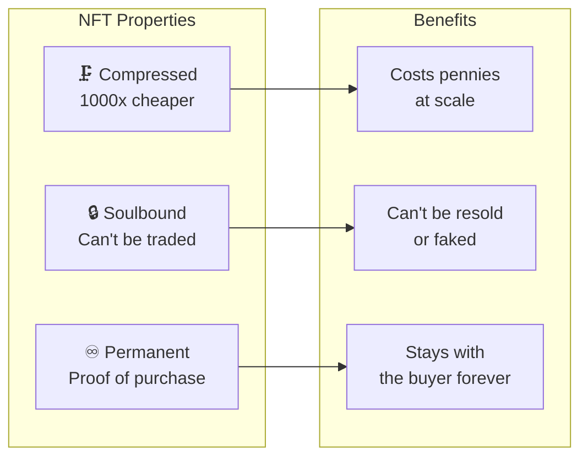
```mermaid
flowchart LR
    subgraph Properties["NFT Properties"]
        A[🗜️ Compressed<br/>1000x cheaper]
        B[🔒 Soulbound<br/>Can't be traded]
        C[♾️ Permanent<br/>Proof of purchase]
    end

    subgraph Benefits["Benefits"]
        D[Costs pennies<br/>at scale]
        E[Can't be resold<br/>or faked]
        F[Stays with<br/>the buyer forever]
    end

    A --> D
    B --> E
    C --> F
```

| Property              | Plain English                                                |
| :-------------------- | :----------------------------------------------------------- |
| **Compressed (cNFT)** | Stored in a special tree so it costs ~$0.0001 instead of $2+ |
| **Soulbound**         | The `nonTransferable` flag blocks all trades                 |
| **Burnable**          | Can be destroyed by the owner or the store if needed         |

### The minting journey

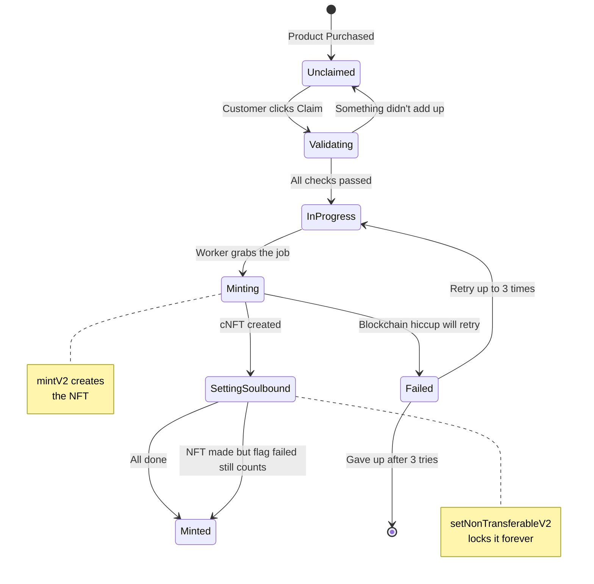
```mermaid
stateDiagram-v2
    [*] --> Unclaimed: Product Purchased

    Unclaimed --> Validating: Customer clicks Claim

    Validating --> InProgress: All checks passed
    Validating --> Unclaimed: Something didn't add up

    InProgress --> Minting: Worker grabs the job

    Minting --> SettingSoulbound: cNFT created
    Minting --> Failed: Blockchain hiccup will retry

    SettingSoulbound --> Minted: All done
    SettingSoulbound --> Minted: NFT made but flag failed still counts

    Failed --> InProgress: Retry up to 3 times
    Failed --> [*]: Gave up after 3 tries

    note right of Minting
        mintV2 creates
        the NFT
    end note

    note right of SettingSoulbound
        setNonTransferableV2
        locks it forever
    end note
```

### The actual Solana code

We use [Metaplex Bubblegum](https://developers.metaplex.com/bubblegum) for cheap compressed NFTs:

```typescript
// Step 1: Create the NFT
const { signature } = await mintV2(umi, {
  leafOwner: recipientWallet,
  merkleTree,
  coreCollection,
  metadata: {
    name: "BORN SOLYD", // ← matched brand prefix
    uri: "https://arweave.net/...", // ← URI_<BRAND> env var
    sellerFeeBasisPoints: 0,
    collection: some(coreCollection),
    creators: [{ address: authority, verified: true, share: 100 }],
  },
}).sendAndConfirm(umi);

// Step 2: Lock it so it can never be sold
await setNonTransferableV2(umi, {
  ...assetWithProof,
  authority: signer,
  coreCollection,
}).sendAndConfirm(umi);
```

---

### 🏷 Brand Metadata Selection

> **ELI5:** Each Shopify product line item starts with a brand name like `BORN SOLYD ...` or `MONKE CONSOLE ...`. We use that prefix to pick the right artwork and on-chain name.

The minter reads the **full Shopify line item name** (e.g. `"BORN SOLYD Phone Case - iPhone 16 Pro Max"`) and looks up the matching brand rule. Each rule is `{ prefix → displayName + URI }`. The on-chain NFT gets the brand display name (e.g. `"BORN SOLYD"`), not the full variant title — Token Metadata caps name at 32 bytes anyway.

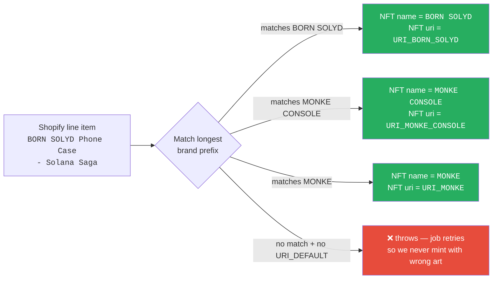
```mermaid
flowchart LR
    A["Shopify line item<br/><code>BORN SOLYD Phone Case<br/>- Solana Saga</code>"] --> B{Match longest<br/>brand prefix}
    B -->|matches BORN SOLYD| C["NFT name = <code>BORN SOLYD</code><br/>NFT uri = <code>URI_BORN_SOLYD</code>"]
    B -->|matches MONKE CONSOLE| D["NFT name = <code>MONKE CONSOLE</code><br/>NFT uri = <code>URI_MONKE_CONSOLE</code>"]
    B -->|matches MONKE| E["NFT name = <code>MONKE</code><br/>NFT uri = <code>URI_MONKE</code>"]
    B -->|no match + no URI_DEFAULT| F["❌ throws — job retries<br/>so we never mint with wrong art"]

    style C fill:#27ae60,color:#fff
    style D fill:#27ae60,color:#fff
    style E fill:#27ae60,color:#fff
    style F fill:#e74c3c,color:#fff
```

**Key rules:**

- Prefixes are sorted **longest-first**, so `MONKE CONSOLE` wins over `MONKE`. New brands? Add them to `BRAND_RULES` in `src/services/minting.ts`.
- Each rule looks up `URI_<BRAND>` and `NAME_<BRAND>` env vars; if unset it falls back to a hardcoded default (e.g. BORN SOLYD has the Arweave URI baked in).
- Matching is case-insensitive and ignores `_`/`-` differences.
- If no prefix matches **and** `URI_DEFAULT` is unset, the mint deliberately throws so the queue retries — better than minting with the wrong artwork.

| Brand prefix examples                                          | Env vars                              |
| :------------------------------------------------------------- | :------------------------------------ |
| `BORN SOLYD`                                                   | `URI_BORN_SOLYD`, `NAME_BORN_SOLYD`   |
| `MONKE CONSOLE`, `MONKE`, `MECHA MONKE`, `THE FUTURE IS MONKE` | `URI_MONKE_CONSOLE`, `URI_MONKE`, ... |
| `KING BONK`, `THE BONK`                                        | `URI_KING_BONK`, `URI_THE_BONK`       |
| `GENESIS`, `PUDGY`, `CLAYNO`, `SOLFLARE`, ...                  | `URI_GENESIS`, `URI_PUDGY`, ...       |

See `src/services/minting.ts → BRAND_RULES` for the full list.

---

### 🌐 Off-Chain Metadata & Website Link

> **ELI5:** The on-chain mint just stores a URL. The image, description, **website**, and attributes that wallets show all live in a JSON file at that URL.

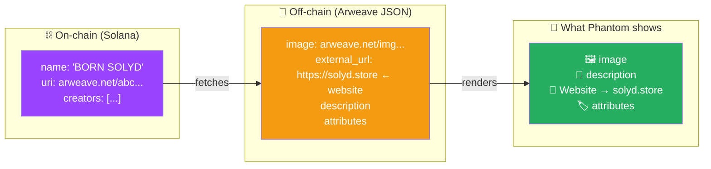
```mermaid
flowchart LR
    subgraph On["⛓️ On-chain (Solana)"]
        A["name: 'BORN SOLYD'<br/>uri: arweave.net/abc...<br/>creators: [...]"]
    end

    subgraph Off["📄 Off-chain (Arweave JSON)"]
        B["image: arweave.net/img...<br/>external_url: https://solyd.store ← website<br/>description<br/>attributes"]
    end

    subgraph Wallet["👀 What Phantom shows"]
        C["🖼 image<br/>📝 description<br/>🔗 Website → solyd.store<br/>🏷 attributes"]
    end

    A -->|fetches| B
    B -->|renders| C

    style A fill:#9945FF,color:#fff
    style B fill:#f39c12,color:#fff
    style C fill:#27ae60,color:#fff
```

The `external_url` field in the JSON is what wallets render as the **website link**. Templates live in `metadata/`. To update a brand's metadata:

1. Edit `metadata/<brand>.json`
2. Replace the image placeholder with a real Arweave tx id
3. Upload the JSON to Arweave (Bundlr / ArDrive)
4. Set the new URL on Heroku: `URI_BORN_SOLYD=https://arweave.net/<new-tx>`
5. Restart the dyno — new mints use the new URI

> ⚠️ **Arweave is immutable.** Already-minted NFTs keep their old URI. Re-uploading + rotating the env var only affects future mints.

---

### 🔥 Burn Authority: who can destroy a soulbound cNFT?

> **ELI5:** The customer who owns the NFT cannot burn it themselves. Only the SOLYD wallet (the one that signed the mint) can burn it.

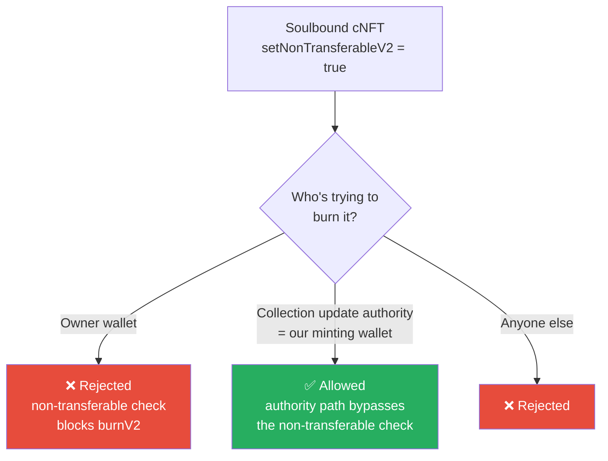
```mermaid
flowchart TB
    A[Soulbound cNFT<br/>setNonTransferableV2 = true] --> B{Who's trying to<br/>burn it?}
    B -->|Owner wallet| C[❌ Rejected<br/>non-transferable check<br/>blocks burnV2]
    B -->|Collection update authority<br/>= our minting wallet| D[✅ Allowed<br/>authority path bypasses<br/>the non-transferable check]
    B -->|Anyone else| E[❌ Rejected]

    style C fill:#e74c3c,color:#fff
    style D fill:#27ae60,color:#fff
    style E fill:#e74c3c,color:#fff
```

**Why:**

- `setNonTransferableV2` flags the leaf as non-transferable. Bubblegum V2 runs that lifecycle check on **both transfer and burn**, so the leaf owner's `burnV2` is rejected.
- The **collection update authority** path of `burnV2` (signer = the wallet from `WALLET_SECRET_BASE64`) is intended for issuer cleanup and bypasses the non-transferable check.

**To revoke / clean up an NFT:**

1. **Hard burn:** call `burnV2` from the minting wallet with `collectionAuthority: signer`. Works while the leaf is still soulbound.
2. **Let the owner burn it themselves:** first call `setNonTransferableV2(false)` on that specific leaf, then the owner can burn (they can also transfer it during that window — there's no burn-only override in Bubblegum V2 today).

### Merkle Tree Capacity

> **ELI5:** All our NFTs live in one big "tree" with 16,384 spots. When it fills up, we need to plant a new tree.

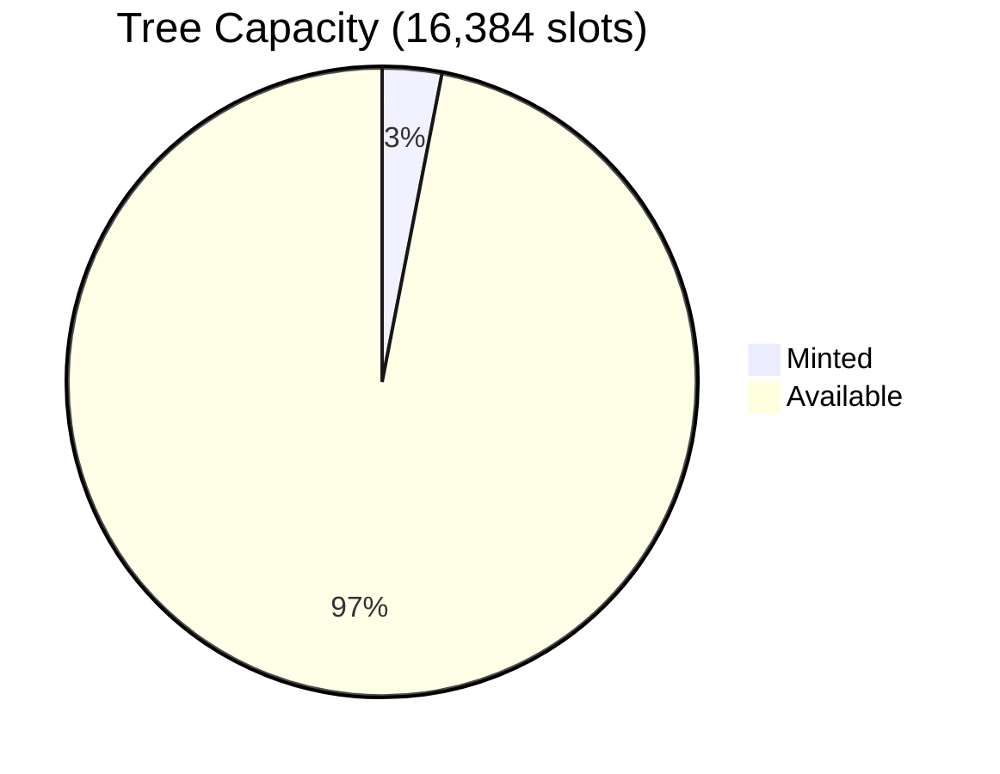
```mermaid
pie title Tree Capacity (16,384 slots)
    "Minted" : 500
    "Available" : 15884
```

> ⚠️ When the tree fills up, create a new one and update `MERKLE_TREE_ADDRESS`.

---

## 📡 Real-Time Events (SSE)

### Why we use SSE instead of "refresh every 15 seconds"

> **ELI5:** The old way was like knocking on the kitchen door every 15 seconds asking "is my food ready yet?" The new way is: the chef rings a bell the moment your food is up.

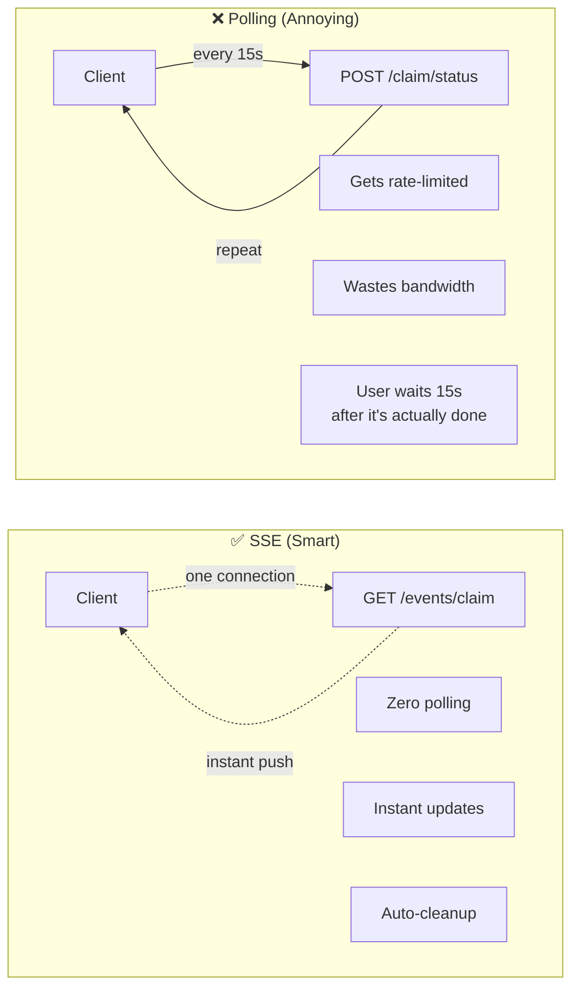
```mermaid
flowchart TB
    subgraph Before["❌ Polling (Annoying)"]
        P1[Client] -->|every 15s| P2[POST /claim/status]
        P2 -->|repeat| P1
        P3[Gets rate-limited]
        P4[Wastes bandwidth]
        P5[User waits 15s<br/>after it's actually done]
    end

    subgraph After["✅ SSE (Smart)"]
        S1[Client] -.->|one connection| S2[GET /events/claim]
        S2 -.->|instant push| S1
        S3[Zero polling]
        S4[Instant updates]
        S5[Auto-cleanup]
    end

    Before ~~~ After
```

### How events flow through the system

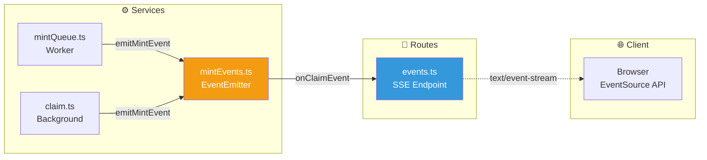
```mermaid
flowchart LR
    subgraph Services["⚙️ Services"]
        MQ[mintQueue.ts<br/>Worker] -->|emitMintEvent| EB[mintEvents.ts<br/>EventEmitter]
        CL[claim.ts<br/>Background] -->|emitMintEvent| EB
    end

    subgraph Routes["🚪 Routes"]
        EB -->|onClaimEvent| EV[events.ts<br/>SSE Endpoint]
    end

    subgraph Client["🌐 Client"]
        EV -.->|text/event-stream| BR[Browser<br/>EventSource API]
    end

    style EB fill:#f39c12,color:#fff
    style EV fill:#3498db,color:#fff
```

| File            | Job                                                |
| :-------------- | :------------------------------------------------- |
| `mintEvents.ts` | A mailbox in memory with a slot for each claimId   |
| `events.ts`     | The route that keeps the browser connection open   |
| `mintQueue.ts`  | Drops letters in the mailbox when stuff happens    |
| `claim.ts`      | Also drops letters when it handles claims directly |

### Event types

| Event           | `mint_status` | When it fires           | What's in the data                   |
| :-------------- | :------------ | :---------------------- | :----------------------------------- |
| `mint_progress` | `in_progress` | Worker starts working   | `attempts`                           |
| `mint_complete` | `minted`      | NFT created and locked  | `asset_id`, `txn_hash`, `claimed_at` |
| `mint_failed`   | `failed`      | Gave up after 3 retries | `error`, `attempts`                  |

### Event payload

```typescript
interface MintEvent {
  type: "mint_progress" | "mint_complete" | "mint_failed";
  claimId: string;
  orderId: string;
  lineItemId: string;
  sku: string;
  data: {
    mint_status: "in_progress" | "minted" | "failed";
    asset_id?: string;
    txn_hash?: string;
    wallet_address?: string;
    claimed_at?: string;
    error?: string;
    attempts?: number;
  };
}
```

---

## 📬 MailerLite VIP Sync

> **ELI5:** Every time someone connects a wallet or claims an NFT, we tell MailerLite. The customer ends up in the right tier (silver, purple, or platina) automatically — without any human pressing buttons.

### What gets synced, when

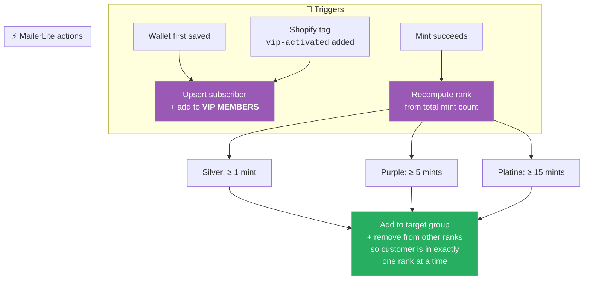
```mermaid
flowchart TB
    subgraph Triggers["🎯 Triggers"]
        T1[Wallet first saved] --> A1
        T2[Mint succeeds] --> A2
        T3[Shopify tag<br/><code>vip-activated</code> added] --> A1
    end

    subgraph Actions["⚡ MailerLite actions"]
        A1[Upsert subscriber<br/>+ add to <strong>VIP MEMBERS</strong>]
        A2[Recompute rank<br/>from total mint count]
    end

    A2 --> R1[Silver: ≥ 1 mint]
    A2 --> R2[Purple: ≥ 5 mints]
    A2 --> R3[Platina: ≥ 15 mints]

    R1 --> G[Add to target group<br/>+ remove from other ranks<br/>so customer is in exactly<br/>one rank at a time]
    R2 --> G
    R3 --> G

    style A1 fill:#9b59b6,color:#fff
    style A2 fill:#9b59b6,color:#fff
    style G fill:#27ae60,color:#fff
```

### Rank thresholds

| Rank       | Default threshold | Env var                        |
| :--------- | :---------------- | :----------------------------- |
| 🥈 Silver  | ≥ 1 mint          | `MAILERLITE_THRESHOLD_SILVER`  |
| 🟣 Purple  | ≥ 5 mints         | `MAILERLITE_THRESHOLD_PURPLE`  |
| 💎 Platina | ≥ 15 mints        | `MAILERLITE_THRESHOLD_PLATINA` |

The thresholds must satisfy `silver < purple < platina` — server fails fast at boot if they don't.

### Safety guarantees

- **Fire-and-forget.** Every MailerLite call is wrapped so a hung MailerLite or wrong API key **never** blocks wallet save, claim, or mint flows. Errors are logged and swallowed.
- **AbortController timeout** on every HTTP call (`MAILERLITE_TIMEOUT_MS`, default 5s).
- **Single-rank invariant.** When a customer crosses a threshold we add them to the new group **and** remove them from the lower ranks, so the audience always reflects current rank.
- **PII minimization.** We send email + name + wallet + mint count. Nothing else.
- **Optional.** If `MAILERLITE_API_KEY` is not set, the whole subsystem is skipped silently. Set it on Heroku to turn it on.

### Adding a new tier

1. Add a group in MailerLite, copy its ID.
2. Add a `MAILERLITE_GROUP_<TIER>` env var on Heroku.
3. Add a `MAILERLITE_THRESHOLD_<TIER>` env var on Heroku.
4. Extend the `VipRank` union and the threshold ladder in `src/services/mailerlite.ts`.

See `src/services/mailerlite.ts` for the implementation.

---

## ⚡ Redis Queue System

### Why a queue?

> **ELI5:** Imagine 1000 kids rushing the ice cream truck at the same time. A queue is a line: everyone waits their turn, the ice cream guy scoops as fast as he can, and nobody gets crushed.

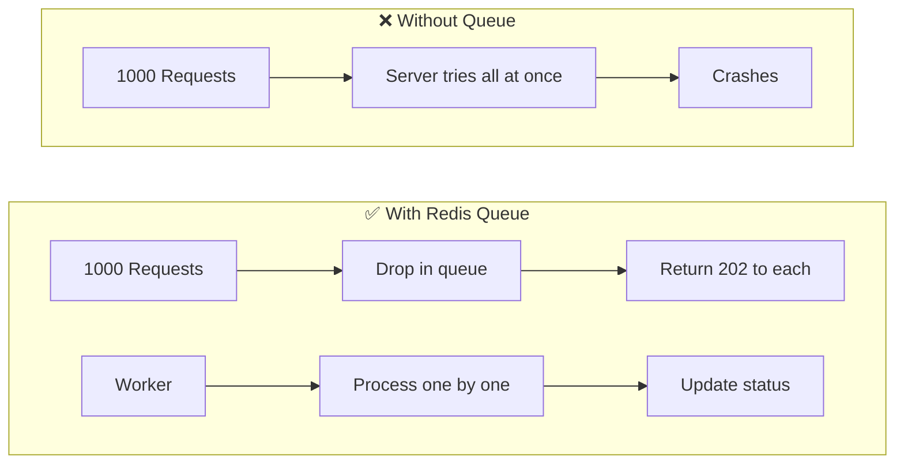
```mermaid
flowchart TB
    subgraph Without["❌ Without Queue"]
        A1[1000 Requests] --> A2[Server tries all at once] --> A3[Crashes]
    end

    subgraph With["✅ With Redis Queue"]
        B1[1000 Requests] --> B2[Drop in queue] --> B3[Return 202 to each]
        B4[Worker] --> B5[Process one by one] --> B6[Update status]
    end

    Without ~~~ With
```

| Challenge                   | How we solve it                |
| :-------------------------- | :----------------------------- |
| Minting takes 30-60 seconds | Queue job, respond immediately |
| Server restart loses jobs   | Redis saves them to disk       |
| 1000 concurrent requests    | Queue absorbs the spike        |
| Failures need retry         | BullMQ auto-retries 3 times    |

### BullMQ requires specific Redis settings

> ⚠️ This bit me hard. If you forget these, you get `ECONNRESET` spam every 20 seconds.

```typescript
// src/config/redis.ts
return {
  host,
  port,
  password,
  tls: { rejectUnauthorized: false }, // Heroku Redis uses self-signed certs

  // HARD REQUIREMENTS from BullMQ:
  maxRetriesPerRequest: null,
  enableReadyCheck: false,

  // Helpful extras:
  keepAlive: 30_000, // Heroku drops idle connections
  retryStrategy: (t) => Math.min(t * 200, 5000),
  reconnectOnError: (err) => /READONLY|ECONNRESET|ETIMEDOUT/.test(err.message),
};
```

### Queue config

```typescript
const JOB_OPTIONS = {
  attempts: 3,
  backoff: { type: "exponential", delay: 5000 }, // 5s → 10s → 20s
  removeOnComplete: { count: 100 },
  removeOnFail: { count: 500 },
};
```

### Scaling workers

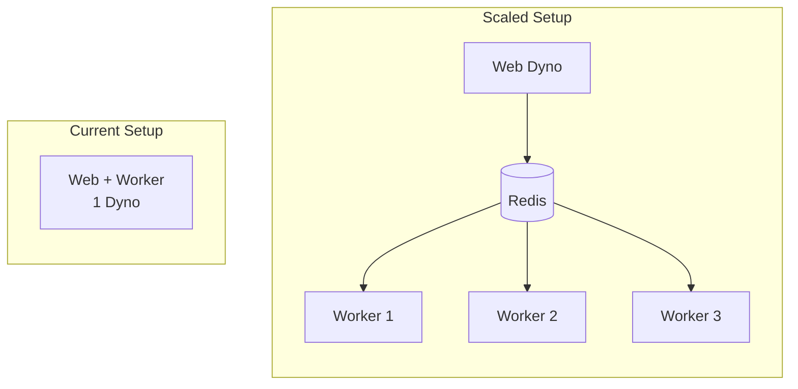
```mermaid
flowchart LR
    subgraph Current["Current Setup"]
        W1[Web + Worker<br/>1 Dyno]
    end

    subgraph Scaled["Scaled Setup"]
        W2[Web Dyno]
        W3[Worker 1]
        W4[Worker 2]
        W5[Worker 3]
        R[(Redis)]
        W2 --> R
        R --> W3
        R --> W4
        R --> W5
    end

    Current ~~~ Scaled
```

**Option 1:** More jobs at once in one dyno

```typescript
startMintWorker(3); // 3 at a time
```

**Option 2:** More dynos

```bash
heroku ps:scale worker=3 -a your-app
```

---

## 🛠 Technology Stack

### Core

| Technology                                                                                                      | Version | Purpose            |
| :-------------------------------------------------------------------------------------------------------------- | :------ | :----------------- |
|           | 20.x    | JavaScript runtime |
|  | 5.x     | Type safety        |
|           | 4.x     | Web framework      |

### Blockchain

| Technology                                                                                          | Purpose           |
| :-------------------------------------------------------------------------------------------------- | :---------------- |
|  | Blockchain        |
| Metaplex Bubblegum                                                                                  | Compressed NFTs   |
| Metaplex UMI                                                                                        | Solana SDK        |
| Helius                                                                                              | RPC + DAS indexer |

### Infrastructure

| Technology                                                                                          | Purpose           |
| :-------------------------------------------------------------------------------------------------- | :---------------- |
|     | Job queue backend |
|  | Cloud hosting     |
| BullMQ                                                                                              | Queue library     |
| Postgres                                                                                            | Mint audit log    |
| Papertrail                                                                                          | Log aggregation   |

### Security

| Technology         | Purpose               |
| :----------------- | :-------------------- |
| Helmet             | Security headers      |
| Zod                | Input validation      |
| express-rate-limit | Rate limiting         |
| tweetnacl          | HMAC signature checks |

---

## 📁 Project Structure

```
solyd-server/
│
├── 📄 package.json           # Dependencies & scripts
├── 📄 tsconfig.json          # TypeScript config
├── 📄 Procfile               # Heroku startup command
├── 📄 .env.example           # Environment template
│
├── 📂 metadata/              # Off-chain NFT JSON templates (image, website, attributes)
│   ├── 📄 README.md            # Upload + env-rotation instructions
│   └── 📄 born-solyd.json      # external_url=https://solyd.store
│
└── 📂 src/
    │
    ├── 📄 index.ts           # Entry point + queue init
    ├── 📄 app.ts             # Express app + middleware
    │
    ├── 📂 config/
    │   ├── 📄 env.ts         # Environment variables
    │   ├── 📄 logger.ts      # Pino structured logging
    │   └── 📄 redis.ts       # Redis connection (BullMQ-safe)
    │
    ├── 📂 middleware/
    │   ├── 📄 auth.ts        # API secret + HMAC verification
    │   ├── 📄 rateLimit.ts   # Rate limiting
    │   └── 📄 requestId.ts   # Request correlation
    │
    ├── 📂 services/
    │   ├── 📄 shopifyToken.ts  # OAuth token manager
    │   ├── 📄 shopify.ts       # Shopify Admin API (uses token mgr)
    │   ├── 📄 wallet.ts        # Wallet operations
    │   ├── 📄 minting.ts       # Solana NFT minting + brand-prefix metadata
    │   ├── 📄 mintQueue.ts     # BullMQ queue + worker
    │   ├── 📄 mintEvents.ts    # SSE event bus
    │   ├── 📄 mintAudit.ts     # Postgres audit log
    │   ├── 📄 mailerlite.ts    # MailerLite VIP rank sync (NEW)
    │   └── 📄 claim.ts         # Claim orchestration
    │
    ├── 📂 routes/
    │   ├── 📄 health.ts      # Health endpoint
    │   ├── 📄 wallet.ts      # Wallet endpoints
    │   ├── 📄 claim.ts       # Claim endpoints
    │   ├── 📄 events.ts      # SSE stream endpoint
    │   └── 📄 legacy.ts      # Legacy order lookup
    │
    └── 📂 types/
        └── 📄 index.ts       # TypeScript interfaces
```

### Layer architecture

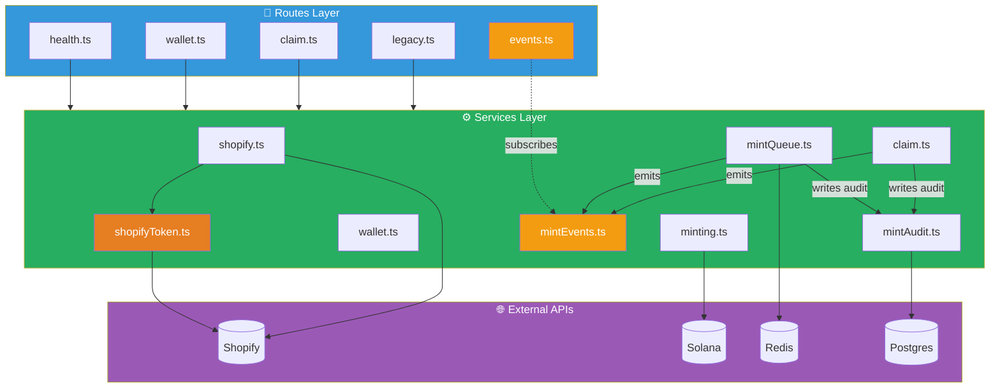
```mermaid
flowchart TB
    subgraph Routes["🚪 Routes Layer"]
        R1[health.ts]
        R2[wallet.ts]
        R3[claim.ts]
        R4[events.ts]
        R5[legacy.ts]
    end

    subgraph Services["⚙️ Services Layer"]
        S1[shopify.ts]
        ST[shopifyToken.ts]
        S2[wallet.ts]
        S3[minting.ts]
        S4[mintQueue.ts]
        S5[claim.ts]
        S6[mintEvents.ts]
        S7[mintAudit.ts]
    end

    subgraph External["🌐 External APIs"]
        E1[(Shopify)]
        E2[(Solana)]
        E3[(Redis)]
        E4[(Postgres)]
    end

    R1 & R2 & R3 & R5 --> Services
    R4 -.->|subscribes| S6
    S4 & S5 -->|emits| S6
    S4 & S5 -->|writes audit| S7
    S1 --> ST --> E1
    S1 --> E1
    S3 --> E2
    S4 --> E3
    S7 --> E4

    style Routes fill:#3498db,color:#fff
    style Services fill:#27ae60,color:#fff
    style External fill:#9b59b6,color:#fff
    style S6 fill:#f39c12,color:#fff
    style R4 fill:#f39c12,color:#fff
    style ST fill:#e67e22,color:#fff
```

---

## 🔒 Security

### Request pipeline

> **ELI5:** Every request goes through a series of checkpoints. Fail any one and you're out.

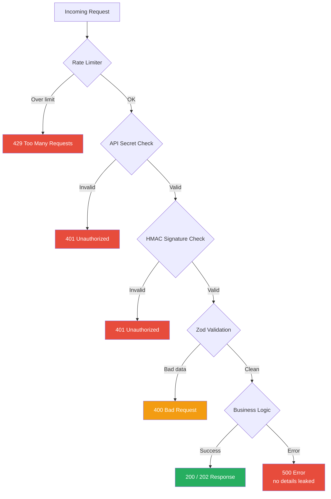
```mermaid
flowchart TD
    A["Incoming Request"] --> B{Rate Limiter}
    B -->|Over limit| C["429 Too Many Requests"]
    B -->|OK| D{API Secret Check}
    D -->|Invalid| E["401 Unauthorized"]
    D -->|Valid| HMAC{HMAC Signature Check}
    HMAC -->|Invalid| HE["401 Unauthorized"]
    HMAC -->|Valid| F{Zod Validation}
    F -->|Bad data| G["400 Bad Request"]
    F -->|Clean| H{Business Logic}
    H -->|Success| I["200 / 202 Response"]
    H -->|Error| J["500 Error<br/>no details leaked"]

    style C fill:#e74c3c,color:#fff
    style E fill:#e74c3c,color:#fff
    style HE fill:#e74c3c,color:#fff
    style G fill:#f39c12,color:#fff
    style I fill:#27ae60,color:#fff
    style J fill:#e74c3c,color:#fff
```

### Security measures

| Layer                     | Threat                    | Protection                      |
| :------------------------ | :------------------------ | :------------------------------ |
| 🚦 **Rate Limiting**      | DDoS, brute force         | 5 claims/min, 30 status/min     |
| 🔑 **API Secret**         | Unauthorized access       | Timing-safe comparison          |
| ✍️ **HMAC Signatures**    | Request tampering, replay | SHA-256 signature + timestamp   |
| 🌐 **CORS**               | Cross-origin attacks      | Strict origin allowlist         |
| ✅ **Validation**         | Injection, malformed data | Zod schemas on every input      |
| 🛡️ **Helmet**             | XSS, clickjacking         | Security headers                |
| 📦 **Body Limit**         | Memory exhaustion         | 16kb max per request            |
| 🔇 **Error Sanitization** | Info leakage              | Generic production errors       |
| 📡 **SSE Timeout**        | Connection exhaustion     | 5-min max, auto-cleanup         |
| 🔐 **Short-lived tokens** | Token leak damage         | Shopify tokens expire every 24h |

---

## ⚙️ Environment Variables

```env
# ═══════════════════════════════════════════════════════════
# 🖥️  SERVER
# ═══════════════════════════════════════════════════════════
PORT=3000
NODE_ENV=production
SOLYD_API_SECRET=your-32-character-minimum-secret
REQUIRE_HMAC=true

# ═══════════════════════════════════════════════════════════
# 🌐 CORS
# ═══════════════════════════════════════════════════════════
ALLOWED_ORIGINS=https://your-portal.vercel.app,https://your-store.myshopify.com

# ═══════════════════════════════════════════════════════════
# 🛒 SHOPIFY (OAuth client credentials, NOT shpat_ token)
# ═══════════════════════════════════════════════════════════
SHOPIFY_STORE_DOMAIN=your-store.myshopify.com
SHOPIFY_CLIENT_ID=your-dev-dashboard-client-id
SHOPIFY_CLIENT_SECRET=your-dev-dashboard-client-secret

# ═══════════════════════════════════════════════════════════
# 🔴 REDIS (auto-set by Heroku addon)
# ═══════════════════════════════════════════════════════════
REDIS_URL=redis://...
REDIS_TLS_URL=rediss://...   # Auto-set on paid tiers

# ═══════════════════════════════════════════════════════════
# 🐘 POSTGRES (audit log)
# ═══════════════════════════════════════════════════════════
DATABASE_URL=postgres://...

# ═══════════════════════════════════════════════════════════
# ⛓️  SOLANA
# ═══════════════════════════════════════════════════════════
WALLET_SECRET_BASE64=base64-encoded-keypair-json
CORE_COLLECTION_ADDRESS=your-collection-pubkey
MERKLE_TREE_ADDRESS=your-tree-pubkey
HELIUS_API_KEY=your-helius-key
HELIUS_RPC_URL=https://mainnet.helius-rpc.com/?api-key=xxx
RPC_ENDPOINT=https://mainnet.helius-rpc.com/?api-key=xxx

# ═══════════════════════════════════════════════════════════
# ⏱️  MINTING SETTINGS
# ═══════════════════════════════════════════════════════════
MINT_MAX_RETRIES=3
MINT_RETRY_DELAY_MS=5000
DAS_INDEXER_DELAY_MS=3000

# ═══════════════════════════════════════════════════════════
# 🏷️  BRAND METADATA (per-brand URI + display name)
# Add one URI_<BRAND> per brand in src/services/minting.ts → BRAND_RULES
# NAME_<BRAND> overrides the on-chain display name (default = the prefix itself)
# ═══════════════════════════════════════════════════════════
URI_BORN_SOLYD=https://arweave.net/<born-solyd-tx>
URI_KING_BONK=https://arweave.net/<king-bonk-tx>
URI_MONKE_CONSOLE=https://arweave.net/<monke-console-tx>
URI_MONKE=https://arweave.net/<monke-tx>
URI_GENESIS=https://arweave.net/<genesis-tx>
# ... (URI_<BRAND> for every brand you mint)
URI_DEFAULT=https://arweave.net/<fallback-tx>   # optional safety net

# Optional display-name overrides
# NAME_BORN_SOLYD="Born Solyd"

# ═══════════════════════════════════════════════════════════
# 📬 MAILERLITE (VIP rank sync — optional, server runs without it)
# ═══════════════════════════════════════════════════════════
MAILERLITE_API_KEY=ml-xxxxxxxx
MAILERLITE_API_URL=https://connect.mailerlite.com/api
MAILERLITE_TIMEOUT_MS=5000

# Group IDs (create these in MailerLite first)
MAILERLITE_GROUP_VIP_MEMBERS=12345
MAILERLITE_GROUP_SILVER=12346
MAILERLITE_GROUP_PURPLE=12347
MAILERLITE_GROUP_PLATINA=12348

# Mint-count thresholds (must satisfy silver < purple < platina)
MAILERLITE_THRESHOLD_SILVER=1
MAILERLITE_THRESHOLD_PURPLE=5
MAILERLITE_THRESHOLD_PLATINA=15
```

---

## 🚀 Deployment

### Heroku setup

```bash
# 1️⃣  Create app
heroku create your-app-name

# 2️⃣  Add Redis
heroku addons:create heroku-redis:mini -a your-app-name

# 3️⃣  Add Postgres (for audit log)
heroku addons:create heroku-postgresql:essential-0 -a your-app-name

# 4️⃣  Add Papertrail (optional, for logs)
heroku addons:create papertrail:choklad -a your-app-name

# 5️⃣  Set config vars
heroku config:set \
  NODE_ENV=production \
  SOLYD_API_SECRET="your-32-char-secret" \
  REQUIRE_HMAC=true \
  ALLOWED_ORIGINS="https://your-portal.vercel.app" \
  SHOPIFY_STORE_DOMAIN="your-store.myshopify.com" \
  SHOPIFY_CLIENT_ID="your-client-id" \
  SHOPIFY_CLIENT_SECRET="your-client-secret" \
  WALLET_SECRET_BASE64="..." \
  CORE_COLLECTION_ADDRESS="..." \
  MERKLE_TREE_ADDRESS="..." \
  HELIUS_API_KEY="..." \
  HELIUS_RPC_URL="https://..." \
  RPC_ENDPOINT="https://..." \
  -a your-app-name

# 6️⃣  Deploy
git push heroku main

# 7️⃣  Check it
heroku logs --tail -a your-app-name
curl https://your-app-name.herokuapp.com/api/health
```

---

## 💻 Local Development

```bash
# 1️⃣  Clone
git clone https://github.com/your-org/solyd-server.git
cd solyd-server

# 2️⃣  Install
npm install

# 3️⃣  Configure
cp .env.example .env
# Edit .env with your values

# 4️⃣  Run
npm run dev

# 5️⃣  Run with local Redis (optional)
docker run -p 6379:6379 redis
# Add REDIS_URL=redis://localhost:6379 to .env

# 6️⃣  Test
curl http://localhost:3000/api/health
```

---

## 🔧 Troubleshooting

### Common issues

| Issue                                | Likely cause                            | Fix                                                     |
| :----------------------------------- | :-------------------------------------- | :------------------------------------------------------ |
| `401 Unauthorized`                   | Wrong/missing API secret                | Check `x-api-secret` header                             |
| `401 HMAC signature invalid`         | Bad signature or clock drift            | Check system time, check HMAC signing code              |
| `429 Too Many Requests`              | Rate limited                            | Wait 60 seconds                                         |
| `503 Minting not available`          | Missing Solana config                   | Set `WALLET_SECRET_BASE64`, `MERKLE_TREE_ADDRESS`, etc. |
| `Shopify returns empty orders array` | Missing scopes or Protected Data access | Request access in Dev Dashboard + reinstall app         |
| Orders older than 60 days not found  | Missing `read_all_orders` scope         | Add scope, release new version, reinstall               |
| `ECONNRESET` spam from `[queue]`     | Missing BullMQ Redis options            | Check `maxRetriesPerRequest: null` in redis.ts          |
| Status stuck at `in_progress`        | Worker not running or Redis down        | Check `/api/claim/health`, check Heroku logs            |
| `Token exchange failed: 401`         | Wrong Shopify Client ID/Secret          | Verify in Dev Dashboard > Settings                      |

### Debugging commands

```bash
# Tail all logs
heroku logs --tail -a your-app

# Just the queue logs
heroku logs --tail -a your-app | grep -E "\[queue\]|\[worker\]|\[minting\]"

# Just the Shopify token logs
heroku logs --tail -a your-app | grep -i shopify

# Check Redis connection
heroku config -a your-app | grep REDIS

# Open Papertrail
heroku addons:open papertrail -a your-app
```

### Reset a stuck claim

1. Go to **Shopify Admin** > **Orders** > Your Order
2. Find the `sbt.mint_data` metafield
3. Change `mint_status` from `in_progress` to `unclaimed`

---

## 🔗 Related Repositories

| Repo                                                                                                           | What it is                                                                                                                                                                                                                                                                                                              |
| :------------------------------------------------------------------------------------------------------------- | :---------------------------------------------------------------------------------------------------------------------------------------------------------------------------------------------------------------------------------------------------------------------------------------------------------------------- |
| 🖥️ **This repo** (`solyd-server`)                                                                              | Node.js / TypeScript / Express backend. Handles Shopify auth, Solana minting, the Redis queue, SSE event stream, and the MailerLite VIP sync. Runs on Heroku.                                                                                                                                                           |
| 🌐 **[`solydstore/inner_circle_solyd_hackathon`](https://github.com/solydstore/inner_circle_solyd_hackathon)** | Next.js / React / TypeScript frontend for the **Inner Circle VIP Portal**. Hosts the post-purchase onboarding flow, Shopify customer auth (OAuth 2.0 + PKCE), wallet selection (Solana Wallet Adapter + Coinbase CDP embedded), and the live mint dashboard that consumes this server's SSE stream. Deployed on Vercel. |

---

## 📚 Documentation Links

### Solana & Metaplex

| Resource              | Link                                                                           |
| :-------------------- | :----------------------------------------------------------------------------- |
| 📖 Solana Docs        | [solana.com/docs](https://solana.com/docs)                                     |
| 🎨 Metaplex Bubblegum | [developers.metaplex.com/bubblegum](https://developers.metaplex.com/bubblegum) |
| 🔧 Metaplex UMI       | [developers.metaplex.com/umi](https://developers.metaplex.com/umi)             |
| ⚡ Helius RPC         | [docs.helius.dev](https://docs.helius.dev/)                                    |

### Shopify

| Resource                     | Link                                                                                                                                       |
| :--------------------------- | :----------------------------------------------------------------------------------------------------------------------------------------- |
| 🛒 Admin GraphQL API         | [shopify.dev/docs/api/admin-graphql](https://shopify.dev/docs/api/admin-graphql)                                                           |
| 🔑 Dev Dashboard Token Guide | [shopify.dev/docs/apps/build/dev-dashboard/get-api-access-tokens](https://shopify.dev/docs/apps/build/dev-dashboard/get-api-access-tokens) |
| 🛡️ Protected Customer Data   | [shopify.dev/docs/apps/launch/protected-customer-data](https://shopify.dev/docs/apps/launch/protected-customer-data)                       |
| 📦 Metafields                | [shopify.dev/docs/apps/custom-data/metafields](https://shopify.dev/docs/apps/custom-data/metafields)                                       |

### Infrastructure

| Resource           | Link                                                                                                       |
| :----------------- | :--------------------------------------------------------------------------------------------------------- |
| ☁️ Heroku Node.js  | [devcenter.heroku.com/articles/nodejs-support](https://devcenter.heroku.com/articles/nodejs-support)       |
| 🔴 Heroku Redis    | [devcenter.heroku.com/articles/heroku-redis](https://devcenter.heroku.com/articles/heroku-redis)           |
| 🐘 Heroku Postgres | [devcenter.heroku.com/articles/heroku-postgresql](https://devcenter.heroku.com/articles/heroku-postgresql) |
| 📋 BullMQ          | [docs.bullmq.io](https://docs.bullmq.io/)                                                                  |
| 📝 Papertrail      | [papertrailapp.com/documentation](https://www.papertrailapp.com/documentation)                             |

### Libraries

| Resource      | Link                                              |
| :------------ | :------------------------------------------------ |
| 🚂 Express.js | [expressjs.com](https://expressjs.com/)           |
| ✅ Zod        | [zod.dev](https://zod.dev/)                       |
| 🪵 Pino       | [getpino.io](https://getpino.io/)                 |
| 🛡️ Helmet     | [helmetjs.github.io](https://helmetjs.github.io/) |

---

<p align="center">
  <strong>SOLYD</strong> © 2026<br/>
  <em>Building the future of physical + digital ownership</em>
</p>
